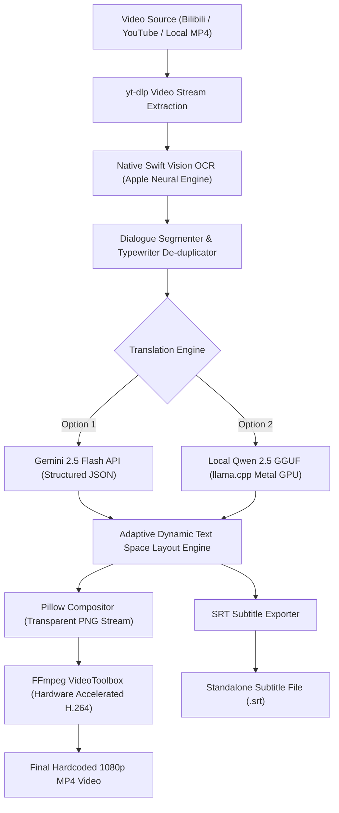

# VN Video Translator - Technical Documentation & Reference

This document provides a comprehensive technical overview of the VN Video Translator pipeline, including architectural design, hardware acceleration, segmentation algorithms, translation engine mechanics, dynamic typesetting, and configuration parameters.

---

## Table of Contents

1. [Architecture Overview](#1-architecture-overview)
2. [Hardware Acceleration & Apple Silicon Integration](#2-hardware-acceleration--apple-silicon-integration)
3. [OCR Engine & Frame Sampling](#3-ocr-engine--frame-sampling)
4. [Dialogue Segmentation & Typewriter De-duplication](#4-dialogue-segmentation--typewriter-de-duplication)
5. [Translation Engines](#5-translation-engines)
   - [Option 1: Gemini 2.5 Flash Cloud](#option-1-gemini-25-flash-cloud)
   - [Option 2: Local Qwen 2.5 via llama.cpp](#option-2-local-qwen-25-via-llamacpp)
6. [Dynamic Text Space & Auto-Fitting Algorithm](#6-dynamic-text-space--auto-fitting-algorithm)
7. [Typography & Rendering Engine](#7-typography--rendering-engine)
8. [Universal Lore & Context System](#8-universal-lore--context-system)
9. [Configuration Reference (`config/default.json`)](#9-configuration-reference-configdefaultjson)
10. [Command-Line Interface Reference](#10-command-line-interface-reference)
11. [Troubleshooting & Common Questions](#11-troubleshooting--common-questions)

---

## 1. Architecture Overview

The pipeline executes a six-stage workflow designed for low latency, high OCR fidelity, and zero subtitle clipping:



### Execution Stages

1. **Ingestion:** Downloads or reads the target video at original 1080p stream resolution.
2. **Optical Character Recognition:** Swift-compiled native binary executes `VNRecognizeTextRequest` against the dialogue region of sampled video frames.
3. **Segmentation:** Merges sequential typewriter frame fragments into unified dialogue lines with millisecond-precision start and end timestamps.
4. **Localization:** Sends grouped batches of lines along with character rosters, faction glossaries, and scene context to the chosen translation engine.
5. **Layout & Typesetting:** Calculates multi-line bounding boxes against dialogue bounds, dynamically scaling font size if line length exceeds container bounds.
6. **Hardware Compositing:** Streams pre-rendered overlays via an FFmpeg concatenation pipeline with Apple Silicon VideoToolbox encoding at 200+ frames per second.

---

## 2. Hardware Acceleration & Apple Silicon Integration

The pipeline leverages native macOS subsystems to maximize throughput and minimize CPU load:

- **Apple Neural Engine (ANE):** Vision OCR requests utilize the on-chip Neural Engine via CoreML/Vision bindings in native Swift (`ocr.swift`), processing a 30-minute 1080p video in approximately 120 seconds (~15x real-time speed).
- **Metal GPU Framework:** Option 2 runs local GGUF models directly within unified memory using Metal acceleration (`-ngl 99`), delivering 35 to 50 tokens per second on Apple M-series chips.
- **VideoToolbox Hardware Encoders:** Final video authoring delegates H.264 encoding to dedicated media engine blocks via `h264_videotoolbox`, reaching encoding speeds exceeding 200 FPS while maintaining pristine 1080p visual fidelity.

---

## 3. OCR Engine & Frame Sampling

Standard optical character recognition models often struggle with complex game fonts, translucent text boxes, and animated character dialogue.

### Implementation Details (`src/ocr.swift` & `src/ocr_engine.py`)

- **Language Support:** Accurate recognition support for Simplified Chinese (`zh-Hans`), Traditional Chinese (`zh-Hant`), Japanese (`ja-JP`), and English (`en-US`).
- **Region of Interest (ROI) Cropping:** Rather than inspecting entire 1920x1080 frames, the engine crops strictly to the dialogue region (configurable via `crop_y_ratio: 0.72` and `crop_h_ratio: 0.28`). This removes background scenery, user interface indicators, and health bars.
- **Sampling Interval:** Default sampling operates at 1.0-second intervals (`sample_interval: 1.0`), balancing transcription completeness with execution speed.

---

## 4. Dialogue Segmentation & Typewriter De-duplication

Visual novel engines employ character-by-character typewriter animations. Naive OCR frame extraction yields dozens of redundant substrings for a single sentence (e.g., `"Hello"`, `"Hello, how"`, `"Hello, how are you?"`).

### De-duplication Logic (`src/segmenter.py`)

1. **Speaker Detection:** Uses bounding coordinate heuristics and layout boundaries to distinguish speaker name labels from body text.
2. **Incremental Substring Merging:** When consecutive frames share identical speaker tags and the text of frame $N+1$ begins with the text of frame $N$, the pipeline extends the end timestamp of frame $N$ rather than creating a new line.
3. **Levenshtein & Prefix Filtering:** Substrings with minor OCR misreadings are resolved against the final stable turn of the dialogue box.
4. **Duration Normalization:** Dialogue lines with durations under 1.2 seconds are padded to prevent flickering, ensuring readable on-screen display times.

---

## 5. Translation Engines

The system implements a unified interface supporting two distinct operational models:

### Option 1: Gemini 2.5 Flash Cloud

- **Target Use Case:** Publication-grade storytelling, nuanced character quirks, sarcasm, formal/casual register control, and complex game lore.
- **Latency:** ~3 to 5 seconds for a complete 30-minute cutscene (300+ lines).
- **Cost:** Approximately $0.0009 to $0.0015 per video episode.
- **Structured Schema:** Employs Gemini's native JSON output schema mode (`responseMimeType: application/json`) to eliminate parsing failures and hallucinated headers.
- **First-Time Setup:** If `GEMINI_API_KEY` is not present, the CLI displays a link to [Google AI Studio](https://aistudio.google.com/app/apikey) and interactively saves the key to `.env`.

### Option 2: Local Qwen 2.5 via llama.cpp

- **Target Use Case:** 100% offline environments, private air-gapped workflows, zero API costs, and continuous bulk translation.
- **Model Recommendation:** `Qwen2.5-3B-Instruct-Q4_K_M.gguf` (~2.0 GB).
- **Hardware Requirement:** 8GB+ RAM / unified memory on macOS.
- **Performance:** 35 to 50 tokens per second on Apple Silicon Metal GPU.
- **Automated Lifecycle:**
  - Detects if `llama-server` is installed; prompts for `brew install llama.cpp` if missing on macOS.
  - Automatically locates existing models in local cache or downloads `Qwen2.5-3B-Instruct` directly from Hugging Face into `./models/` with progress tracking.
  - Automatically spawns and terminates the background `llama-server` process during the translation run.

---

## 6. Dynamic Text Space & Auto-Fitting Algorithm

A primary flaw in automated subtitle tools is text collision, where lengthy translations overflow the dialogue box or render over character art.

### Fitting Logic (`src/layout.py`)

1. **Available Rectangle Calculation:**
   $$\text{Width}_{\text{available}} = \text{Box Width} - (2 \times \text{Padding}_X)$$
   $$\text{Height}_{\text{available}} = \text{Box Height} - (2 \times \text{Padding}_Y) - \text{Header Allowance}$$

2. **Word Wrapping & Bounds Inspection:**
   The algorithm wraps dialogue text into lines using word-break calculations and calculates the pixel bounding box with Pillow's `multiline_textbbox()`.

3. **Step-Down Font Scaling:**
   - Default font size begins at `28pt` (accommodating ~95% of standard visual novel lines without downscaling).
   - If computed text width exceeds $\text{Width}_{\text{available}}$ or height exceeds $\text{Height}_{\text{available}}$, the layout engine decrements font size sequentially:
     $$\text{Size} \in \{28, 26, 24, 22, 20, 18, 16\}$$
   - Once the bounding box fits completely within the container, rendering proceeds.
   - If bounds are exceeded even at `min_font_size` (`16pt`), the system tightens line spacing to guarantee container retention.

---

## 7. Typography & Rendering Engine

### Bundled Fonts (`assets/fonts/`)

- `latex` (`STIXTwoText.ttf`): Authentic LaTeX book serif typography, optimized for storytelling and dialogue readability.
- `arial` (`Arial.ttf` & `ArialBold.ttf`): Modern, clean sans-serif typography.
- `times` (`TimesNewRoman.ttf`): Traditional roman serif styling.
- `custom`: Direct path to any user-provided `.ttf` or `.otf` font file.

### Dialogue Box Styling

The renderer creates an alpha-blended overlay (`rgba(10, 15, 26, 215)`) featuring rounded corners (`radius: 10px`) positioned exactly over the original game text box. This conceals original Chinese/Japanese dialogue cleanly without blocking character art or action sequences.

---

## 8. Universal Lore & Context System

### Schema Structure (`lore/template.json`)

To configure localization for any game or visual novel, provide a JSON definition:

```json
{
  "game_title": "Game Title Here",
  "synopsis": "High-level plot summary to inform model tone and terminology.",
  "characters": {
    "OriginalName": {
      "en_name": "LocalizedName",
      "voice": "Speech style, tone description, formality, quirks."
    }
  },
  "glossary": {
    "SourceTerm": "TargetTerm",
    "FactionName": "LocalizedFaction"
  }
}
```

### Pre-Configured Presets

- `gfl2`: Comprehensive lore preset for *Girls' Frontline 2: Exilium* (`lore/gfl2.json`), mapping Commander titles, T-Doll names (Groza, Nemesis, Colphne, Charolic, Vepley, Sharkry, Krolik), factions (ELID, PMCs, Yellow Zone), and weapon classifications.

### Base Prompt Customization

The base system prompt resides in [`config/prompt_template.txt`](file:///Users/yugendren/projects/vn-video-translator/config/prompt_template.txt). Both Option 1 (Gemini) and Option 2 (Local Qwen) read from this file, allowing direct modifications to translation rules, tone constraints, and formatting requirements without changing Python source code.

---

## 9. Configuration Reference (`config/default.json`)

| Parameter | Type | Default | Description |
| :--- | :--- | :--- | :--- |
| `sample_interval` | `float` | `1.0` | Frame sampling frequency for OCR in seconds. |
| `crop_y_ratio` | `float` | `0.72` | Vertical offset ratio for dialogue box crop region. |
| `crop_h_ratio` | `float` | `0.28` | Height ratio of dialogue box crop region. |
| `ocr_languages` | `list` | `["zh-Hans", "en-US"]` | Priority recognition languages for Apple Vision. |
| `target_language` | `string` | `"English"` | Target translation output language. |
| `font` | `string` | `"latex"` | Default font preset (`latex`, `arial`, `times`, or file path). |
| `font_size` | `int` | `28` | Primary dialogue font size in points. |
| `min_font_size` | `int` | `16` | Floor font size for automatic dynamic downscaling. |
| `speaker_font_size` | `int` | `22` | Font size in points for speaker labels. |
| `dialogue_box` | `list` | `[140, 785, 1780, 1030]` | Pixel coordinates `[x1, y1, x2, y2]` of dialogue overlay. |
| `video_bitrate` | `string` | `"4500k"` | Target video encoding bitrate for FFmpeg. |

---

## 10. Command-Line Interface Reference

```text
usage: translate.py [-h] [--about] [--links LINKS] [--add-link ADD_LINK]
                    [--engine {auto,1,2,gemini,local}] [--api-key API_KEY]
                    [--model-path MODEL_PATH] [--font FONT]
                    [--font-size FONT_SIZE] [--min-font-size MIN_FONT_SIZE]
                    [--lore LORE] [--context CONTEXT]
                    [--target-lang TARGET_LANG] [--config CONFIG]
                    [--output OUTPUT]
                    [input]
```

### Argument Details

- `input`: Video URL (Bilibili/YouTube), path to a `.txt` link roster, or local video file (`.mp4`, `.mkv`, `.mov`).
- `--about`: Displays quick-start reference and option guides without running setup.
- `--links PATH`: Custom path to a list of links (defaults to `links.txt`).
- `--add-link URL`: Appends a link to `links.txt` and immediately initiates processing.
- `--engine {1,2,auto}`:
  - `1` or `gemini`: Forces Gemini 2.5 Flash Cloud translator.
  - `2` or `local`: Forces Local Qwen GGUF translator.
  - `auto`: Uses Gemini if key is available; otherwise prompts for selection.
- `--api-key KEY`: Supplies Gemini API key directly from command line.
- `--model-path PATH`: Direct file path to a custom GGUF model for local inference.
- `--font FONT`: Selects font (`latex`, `arial`, `times`, or custom `.ttf` path).
- `--font-size INT`: Sets base font size in points (default: 28).
- `--min-font-size INT`: Sets minimum auto-fitting font size in points (default: 16).
- `--lore PATH`: Path to lore JSON or preset name (`gfl2`).
- `--context STR`: Contextual notes injected into the model prompt for specific scenes.
- `--target-lang STR`: Target translation language (default: `English`).
- `--output PATH`: Target directory for rendered media and subtitles (default: `output/`).

---

## 11. Troubleshooting & Common Questions

### Bilibili Downloads Fail with HTTP 412 (Precondition Failed)
Bilibili implements bot-mitigation checks on older download clients. Ensure `yt-dlp` is upgraded to the latest version:
```bash
brew upgrade yt-dlp
```

### FFmpeg Exits with Code 1 on Encoding
Ensure FFmpeg is installed via Homebrew so that VideoToolbox hardware acceleration bindings are present:
```bash
brew install ffmpeg
```

### How Do I Keep Subtitles External Without Hardcoding?
The pipeline always exports a standalone `.srt` file to the output directory (`output/<title>_English.srt`). You can load this subtitle file into VLC, IINA, or any media player alongside raw video files.
