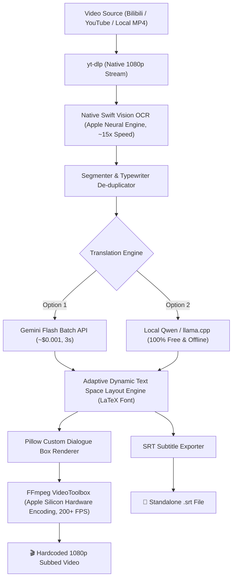

# 🎮 VN Video Translator & Localizer

An automated, hardware-accelerated pipeline designed to download, OCR-transcribe, lore-translate, and naturally hardcode subtitles for **Visual Novel cutscenes and story videos** (e.g. *Girls' Frontline 2: Exilium*, *Genshin Impact*, *Honkai: Star Rail*, *Arknights*, *Fate/Grand Order*, and standalone VN games).

---

## ✨ Key Features

- **⚡ Native Apple Silicon OCR:** Uses macOS's Vision framework via Swift (`VNRecognizeTextRequest`) to extract Chinese/Japanese dialogue text directly from the dialogue box at **~12–15× real-time speed** on your Mac's Neural Engine.
- **🔄 Typewriter De-duplication:** Automatically stabilizes typewriter text animations and merges incremental frame prefixes into clean, contiguous dialogue turns with exact timestamps.
- **🤖 Dual Translation Engines (Option 1 vs Option 2):**
  - **Option 1 (Gemini Flash Cloud):** Studio-quality localization, capturing distinct character personalities and deep game lore for less than **one-tenth of a cent (~$0.0009)** per 30-minute episode.
  - **Option 2 (Local Qwen Model / llama.cpp):** **100% offline, 100% free**, zero API key required, runs locally on your Mac's Metal GPU at ~35–50 tokens/sec.
- **📐 Smart Dynamic Text Space & Auto-Fitting:** Fixed base font size (`28pt`) for 95% of normal lines. If an exceptionally long line exceeds the dialogue box, it automatically decrements font size step-by-step (`28pt → 26pt → 24pt → 20pt → 16pt`) to guarantee zero text overflow or edge collision.
- **✒️ Bundled LaTeX & Custom Typography:** Includes authentic LaTeX serif (`STIX Two Text`), modern sans-serif (`Arial`), and classic book serif (`Times New Roman`) out of the box.
- **📖 Universal Lorebook & Context System:** Provide character rosters, speech quirks, and faction glossaries via `--lore` files or pass scene context on the fly with `--context`. The base prompt is directly editable in `config/prompt_template.txt`.
- **🚀 Hardware Video Acceleration:** Uses macOS `h264_videotoolbox` in FFmpeg to composite and render 1080p subbed videos at **200+ FPS (~7.6× real-time)**.
- **📦 Dual Output:** Produces both the **hardcoded 1080p MP4** and a standalone **`.srt` subtitle file**.

---

## 🚀 Quick Start (One-Line Run)

### 1. Clone the repository
```bash
git clone https://github.com/yugendren/vn-video-translator.git
cd vn-video-translator
```

### 2. View Quick Guide
```bash
./run.sh --about
```

### 3. Run the Pipeline

#### Batch process from `links.txt`
Paste your Bilibili or YouTube links into `links.txt`, then run:
```bash
./run.sh
```

#### Option 1: High-Quality Cloud (Gemini Flash)
```bash
./run.sh "https://www.bilibili.com/video/BV1sbhk6GEtY?p=1" --engine 1 --lore gfl2
```

#### Option 2: 100% Free & Offline (Local Qwen Model)
```bash
./run.sh "https://www.bilibili.com/video/BV1sbhk6GEtY?p=1" --engine 2 --font latex
```

#### Append a URL to `links.txt` and immediately run
```bash
./run.sh --add-link "https://www.bilibili.com/video/BV..."
```

#### Process a local video file
```bash
./run.sh /path/to/my_recording.mp4
```

---

## 🚀 First-Launch & Engine Setup (Zero Friction)

The pipeline is designed to be completely beginner-friendly. On first launch, it walks you through whichever option you choose:

### Option 1: Gemini Flash Cloud (Studio Localization)
- **Free Key Link:** [Google AI Studio (https://aistudio.google.com/app/apikey)](https://aistudio.google.com/app/apikey)
- **First Launch Experience:** If no key is configured, the CLI displays a clear dialog with the direct link above, prompts you to paste the key, and asks:
  ```text
  💾 Save key to .env so you don't have to enter it again? [Y/n]:
  ```
  Answering `y` writes it to `.env` permanently.
- **Alternative ways to supply the key:**
  - `.env` file in repo root: `GEMINI_API_KEY=AIzaSy...`
  - Shell environment: `export GEMINI_API_KEY="AIzaSy..."`
  - CLI flag: `./run.sh "https://..." --api-key "AIzaSy..."`

### Option 2: Local Qwen Model (100% Free & Offline)
- **Zero API keys or accounts required.**
- **Automatic llama.cpp Verification:**
  - On macOS, if `llama-server` is not installed, the CLI prompts:
    ```text
    Would you like to install llama.cpp via Homebrew now? (brew install llama.cpp) [Y/n]:
    ```
    Confirming automatically installs it with full Apple Silicon Metal GPU acceleration.
- **Automatic Model Download:**
  - The CLI looks in `./models/` and your HuggingFace cache (`~/.cache/huggingface/hub`).
  - If no model is found, it asks:
    ```text
    Would you like to auto-download Qwen2.5-3B-Instruct now to ./models/? [Y/n]:
    ```
    Confirming streams `qwen2.5-3b-instruct-q4_k_m.gguf` (~2.0 GB) from Hugging Face with a real-time progress bar, speed, and ETA.
  - Or manually download any `.gguf` into the `./models/` directory:
    ```bash
    curl -L -o models/qwen2.5-3b-instruct-q4_k_m.gguf "https://huggingface.co/Qwen/Qwen2.5-3B-Instruct-GGUF/resolve/main/qwen2.5-3b-instruct-q4_k_m.gguf"
    ```

---


## 🛠️ Command Line Options

```text
usage: translate.py [-h] [--about] [--links LINKS] [--add-link ADD_LINK]
                    [--engine {auto,1,2,gemini,local}] [--api-key API_KEY]
                    [--model-path MODEL_PATH] [--font FONT]
                    [--font-size FONT_SIZE] [--min-font-size MIN_FONT_SIZE]
                    [--lore LORE] [--context CONTEXT]
                    [--target-lang TARGET_LANG] [--config CONFIG]
                    [--output OUTPUT]
                    [input]

options:
  --about               Show dead-simple guide on how it works & Option 1 vs 2
  --links LINKS         Path to links file (default: links.txt)
  --add-link ADD_LINK   Append a URL to links.txt and immediately run
  --engine {1,2,auto}   [1/gemini] = Gemini Flash, [2/local] = Local Qwen model
  --api-key API_KEY     Gemini API Key (Option 1)
  --model-path PATH     Path to local .gguf model (Option 2)
  --font FONT           Subtitle font: latex, arial, times, or path to .ttf (default: latex)
  --font-size SIZE      Base dialogue font size in pt (default: 28)
  --min-font-size SIZE  Minimum font size for auto-fitting long lines (default: 16)
  --lore LORE           Lore preset or JSON path (e.g. gfl2, genshin, or lore/custom.json)
  --context CONTEXT     One-off scene context or background notes for the translator
  --target-lang LANG    Target language (default: English)
  --config CONFIG       Path to configuration JSON (default: config/default.json)
  --output OUTPUT       Output directory (default: output/)
```

---

## 📖 Universal Lore & Context System

To translate **any** visual novel or anime game with lore accuracy:

1. **Pre-built Lore Presets:**
   - `--lore gfl2` (*Girls' Frontline 2: Exilium*)
   - `--lore lore/template.json` (Custom starter template)

2. **Custom Lore JSON (`lore/my_game.json`):**
   ```json
   {
     "game_title": "Fate/stay night",
     "synopsis": "Fifth Holy Grail War in Fuyuki City.",
     "characters": {
       "远坂凛": { "en_name": "Rin Tohsaka", "voice": "Tsundere, sharp-tongued, proud mage." },
       "卫宫士郎": { "en_name": "Shirou Emiya", "voice": "Earnest, idealistic, stubborn." }
     },
     "glossary": {
       "圣杯战争": "Holy Grail War",
       "令咒": "Command Spells",
       "宝具": "Noble Phantasm"
     }
   }
   ```

3. **Editable Base Prompt:**
   You can customize the base system prompt directly in `config/prompt_template.txt`. Both Gemini and the local model use this template.

---

## 🏗️ Architecture



---

## 📋 Requirements
- **macOS** (Apple Silicon M1/M2/M3/M4 recommended for native Vision OCR and VideoToolbox)
- **Homebrew:** `brew install ffmpeg yt-dlp`
- **Python 3.10+** (virtual environment managed automatically by `./run.sh`)
