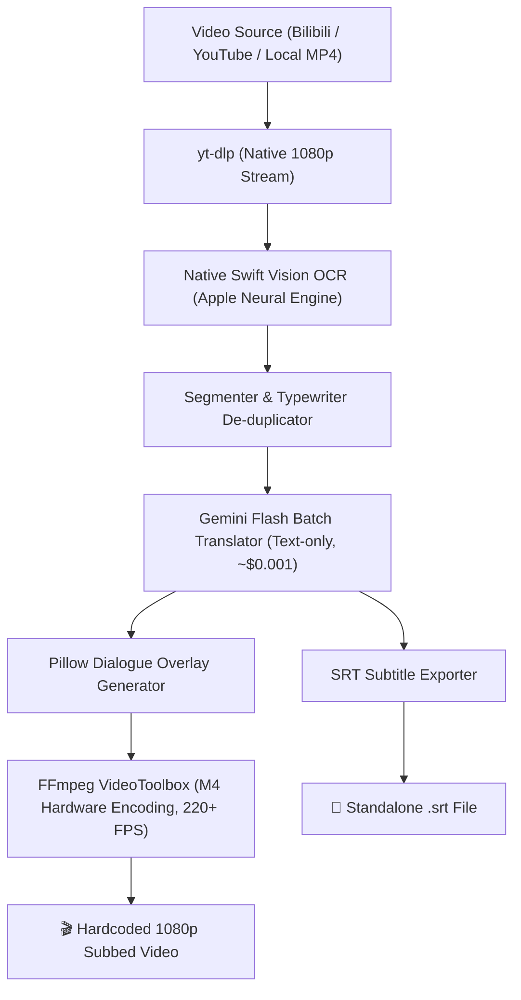

# 🎮 VN Video Translator & Localizer

An automated, hardware-accelerated pipeline designed to download, OCR-transcribe, lore-translate, and naturally hardcode subtitles for **Visual Novel cutscenes and story videos** (e.g. *Girls' Frontline 2: Exilium*, *Genshin Impact*, *Honkai: Star Rail*, *Arknights*, *Fate/Grand Order*, and classic VN games).

---

## ✨ Features

- **⚡ Native Apple Silicon OCR:** Uses macOS's native Vision framework via Swift (`VNRecognizeTextRequest`) to extract Chinese/Japanese dialogue text directly from the bottom text box at **~12–15× real-time speed** on your Mac's Neural Engine.
- **🔄 Typewriter De-duplication:** Automatically stabilizes typewriter text animations and merges incremental frame prefixes into clean, contiguous dialogue turns with exact timestamps.
- **🌐 Studio-Quality Translation:** Sends structured text batches to Gemini Flash for lore-accurate, immersive English translation—costing less than **one-tenth of a cent (~$0.0009)** per 30-minute episode.
- **🎨 Natural Game UI Overlays:** Seamlessly covers original foreign text boxes with authentic translucent banners, matching fonts, and `|||| Character` speaker tags.
- **🚀 Hardware Video Acceleration:** Uses macOS `h264_videotoolbox` in FFmpeg to composite and render 1080p subbed videos at **200+ FPS (~7.6× real-time)**.
- **📦 Dual Output:** Produces both the **hardcoded 1080p MP4** and a standalone **`.srt` subtitle file**.

---

## 🚀 Quick Start (One-Line Run)

### 1. Clone the repository
```bash
git clone https://github.com/your-username/vn-video-translator.git
cd vn-video-translator
```

### 2. Set your Gemini API key (optional)
You can create a `.env` file or export the variable in your terminal:
```bash
export GEMINI_API_KEY="your_api_key_here"
```
*(If omitted, you will be prompted securely in the terminal).*

### 3. Run the pipeline

#### Option A: Process links from `links.txt`
Simply paste your Bilibili or YouTube links into `links.txt`, then run:
```bash
./run.sh
```

#### Option B: Pass a single URL directly
```bash
./run.sh "https://www.bilibili.com/video/BV1sbhk6GEtY?p=1"
```

#### Option C: Add a new link to `links.txt` and immediately run
```bash
./run.sh --add-link "https://www.bilibili.com/video/BV1sbhk6GEtY?p=2"
```

#### Option D: Process a local video file
```bash
./run.sh /path/to/my_gameplay_recording.mp4
```

---

## 🛠️ CLI Options

```text
usage: translate.py [-h] [--links LINKS] [--add-link ADD_LINK] [--config CONFIG]
                    [--output OUTPUT] [--api-key API_KEY] [--target-lang TARGET_LANG]
                    [--game GAME] [input]

Automated VN Video Translator & Localizer

positional arguments:
  input                 URL, path to links.txt, or video file

options:
  --links LINKS         Path to text file containing links (default: links.txt)
  --add-link ADD_LINK   Append a URL to links file and run
  --config CONFIG       Path to configuration JSON (default: config/default.json)
  --output OUTPUT       Output directory (default: output/)
  --api-key API_KEY     Gemini API Key
  --target-lang TARGET_LANG
                        Target language (e.g. English, Vietnamese)
  --game GAME           Game name or lore context prompt
```

---

## ⚙️ Configuration (`config/default.json`)

You can customize the dialogue crop region, sampling speed, and overlay styling for any game:

```json
{
  "crop_y_ratio": 0.72,
  "crop_h_ratio": 0.28,
  "sample_interval": 1.0,
  "ocr_languages": ["zh-Hans", "en-US"],
  "target_language": "English",
  "game_context": "Visual Novel / Anime story cutscene (Girls' Frontline 2)",
  "box_color": [14, 24, 27, 248],
  "box_rect_1080p": [78, 825, 1842, 1047],
  "speaker_font_size": 30,
  "dialogue_font_size": 27,
  "video_bitrate": "4500k"
}
```

* **`crop_y_ratio` & `crop_h_ratio`:** Defines the vertical portion of the video to scan (default: bottom 28% where visual novel text boxes are located).
* **`sample_interval`:** Time between OCR scans in seconds (default: 1.0s).
* **`box_rect_1080p`:** The exact pixel coordinates `[x1, y1, x2, y2]` of the dialogue box in 1080p.

---

## 🏗️ Architecture



---

## 📋 Requirements
- **macOS** (Apple Silicon M1/M2/M3/M4 recommended for native Vision OCR and VideoToolbox)
- **Homebrew:** `brew install ffmpeg yt-dlp`
- **Python 3.10+** (virtual environment managed automatically by `./run.sh`)
